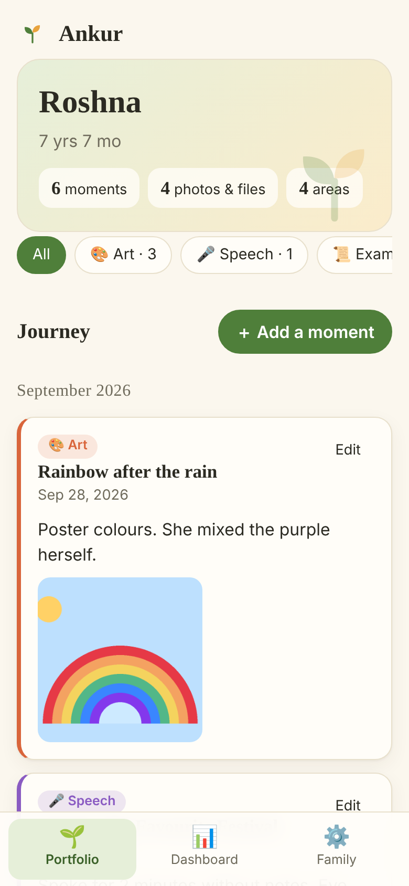
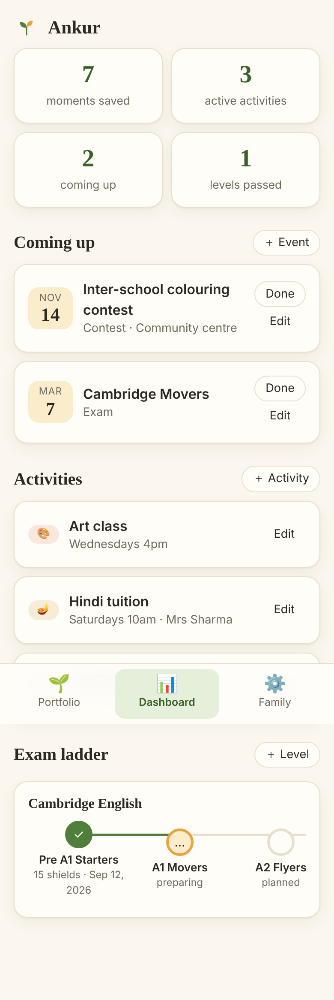
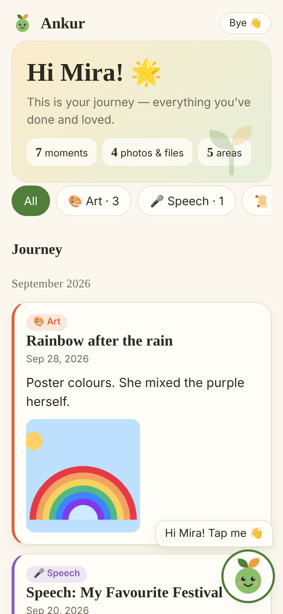
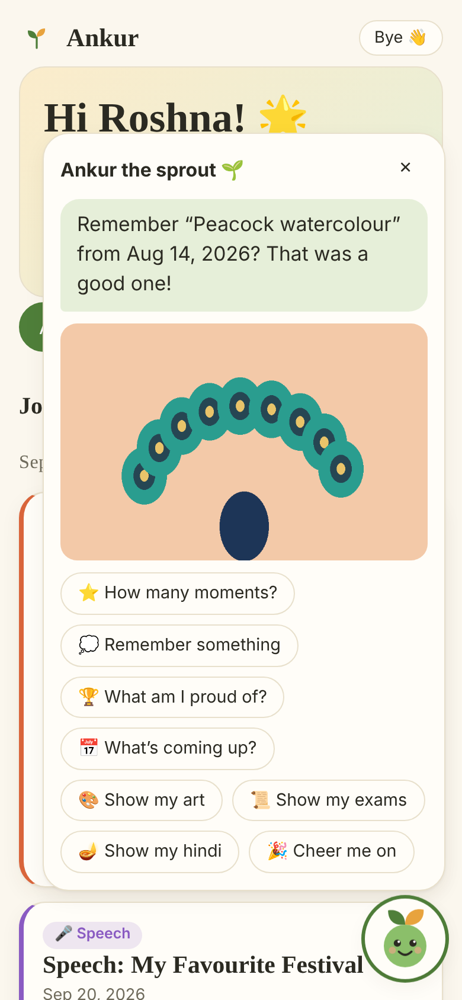

# Ankur 🌱

A private growth portfolio and parent dashboard for our children — art, speech, Cambridge exams, Hindi, accolades and everything in between, kept safe in one place.

*Ankur (அங்குரம் / अंकुर) means "sprout".*

## What's in the MVP

- **Private by design** — login only. Nothing is public, uploads are served only to signed-in users, pages are `noindex`.
- **Three roles** — *Parent* (add/edit everything), *Family* (view the portfolio only) and *Child* (view their own journey, with Buddy).
- **Portfolio journey** — a timeline of moments with notes, photos, voice/speech recordings, videos and PDFs. Filter by Art, Speech, Exams, Hindi, Accolades, School.
- **Parent dashboard** — upcoming contests & exams, activities (Hindi tuition, art class, …) and an **exam ladder** (Cambridge Starters → Movers → Flyers → KET → PET pre-seeded; add any track).
- **Kid login + Buddy** — each child can have a view-only login (fenced to their own profile) with a friendly, tappable sprout buddy. Parents don't see it. See [docs/WHY.md](docs/WHY.md).
- **Multi-child ready**, installable on a phone (PWA), light/dark mode.

## Screens (sample data)

| Parent — portfolio | Parent — dashboard | Kid login | Kid — Buddy |
| --- | --- | --- | --- |
|  |  |  |  |

## Why this exists

Capture, not generation: AI can make a PDF in a minute, but only from what was saved at the time. Read [docs/WHY.md](docs/WHY.md) for the problem, why it is deliberately *not* blockchain, honest weaknesses, and how we'll test whether it's worth keeping.

## Try it with demo data

```bash
npm install
npm run seed        # loads a fictional family (add --reset via `npm run seed:reset` to wipe data/ first)
npm start           # then open http://localhost:3000
```

| Who | Sign in with | What they see |
| --- | --- | --- |
| Parent | `parent@example.com` / `ankur-demo-1` | Everything, can edit |
| Family | `grandma@example.com` / `grandma-pass1` | Portfolio, view only |
| **Kid** | tap **🧒 I’m a kid**, then `mira` / `sprout1` | Her own journey, view only, with Buddy |

Parents can also see the kid view without signing out: **Family → 👀 Preview kid view**.
The demo family is fictional — real use starts from a fresh app, where the first screen sets up your own account.

## Run it

Requires **Node 22.13+** (uses the built-in `node:sqlite`, so no native build step).

```bash
npm install
npm start            # http://localhost:3000
npm test             # API tests
```

On first visit you'll be asked to create the parent account and the first child. After that, invite family — or create the child's own login (a simple username + short password) — from **Family → Invite**.

| Env var | Purpose |
| --- | --- |
| `PORT` | Port to listen on (default `3000`) |
| `ANKUR_DATA_DIR` | Where the SQLite DB and uploads live (default `./data`) |
| `COOKIE_SECURE=1` | Mark the session cookie `Secure` — **set this behind HTTPS** |
| `TRUST_PROXY=1` | Trust one reverse proxy hop (for correct client IPs behind nginx/Caddy) |

## Deploying on AWS (outline)

1. EC2 or Lightsail small instance, Node 22, put the app in `/opt/ankur`.
2. Run under systemd with `ANKUR_DATA_DIR=/var/lib/ankur`, `COOKIE_SECURE=1`, `TRUST_PROXY=1`.
3. Caddy or nginx in front for HTTPS on your domain (Let's Encrypt).
4. **Back up `ANKUR_DATA_DIR`** (DB + `uploads/`) — e.g. nightly snapshot or `aws s3 sync`. This is the only copy of the memories.

## Layout

```
server.js   Express API + static hosting
db.js       SQLite schema and helpers
public/     Single-page app (vanilla JS, no build step), PWA manifest, service worker
test/       API tests (node --test)
```

## Roadmap ideas

Per-entry visibility (hide some from family), shareable "portfolio PDF" export, yearly highlights, reminders for upcoming events, S3 storage for media, multi-family accounts.
